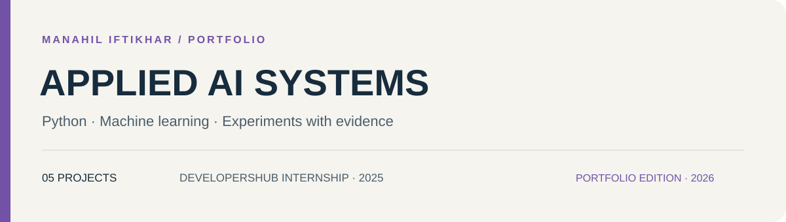
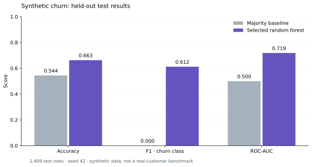

# Advanced experiments · AI/ML internship portfolio

**Manahil Iftikhar** · Python · Machine learning · Applied AI

A collection of 5 projects originating from my 2025 DevelopersHub Corporation internship. This maintained portfolio edition adds readable project guides, local VS Code workflows, reusable Python components, and checks that make the work easier to inspect and reproduce.

[Explore projects](#projects) · [Run locally](docs/SETUP.md) · [Verification](docs/VERIFICATION.md) · [Original submissions](archive/) · [Companion collection](https://github.com/Manahil-Iftikhar/developershub-aiml-internship-tasks-2025)

## Start here

Open [the synthetic churn pipeline](notebooks/02-churn-pipeline.ipynb) for a complete local training example that requires no external dataset.

Each project page explains the problem, data, current implementation, recorded evidence, and next experiment. Original assignment titles are preserved for traceability; the descriptions reflect what the code currently does.

## Projects

| Task | Project | Focus | Execution / implementation state |
| --- | --- | --- | --- |
| 1 | [BERT news classification](docs/projects/01-bert-news.md) | Transformer training, text classification, and evaluation | Training code present; completed evaluation not in the archive |
| 2 | [Customer churn pipeline](docs/projects/02-churn-pipeline.md) | Reusable preprocessing, model selection, and serialization | Runs offline on explicitly synthetic data |
| 3 | [Housing: tabular baseline](docs/projects/03-housing-baseline.md) | Ames-style housing regression; multimodal extension pending | CSV required; paired image branch not implemented |
| 4 | [Document assistant](docs/projects/04-context-assistant.md) | Retrieval, source inspection, and conversation state | Local app included; model-backed execution requires downloads |
| 5 | [Support ticket tagging](docs/projects/05-ticket-tagging.md) | Zero-shot/few-shot prompts and controlled labels | Prompt/parser checks pass offline; model quality not established |

## A recorded experiment



On the seeded **synthetic** dataset, the selected random forest achieved test ROC-AUC **0.7186**, versus **0.5000** for the majority baseline. The model was selected on separate validation data. Read the [experiment record](docs/VERIFICATION.md) and [full metrics](reports/synthetic-churn.json) for the split, environment, and limitations.

## Working in VS Code

```bash
git clone https://github.com/Manahil-Iftikhar/DevelopersHub-AI-ML-Internship-Assignment-2.git
cd DevelopersHub-AI-ML-Internship-Assignment-2
python -m venv .venv
```

Activate `.venv`, install `requirements-notebook.txt`, and select that environment in VS Code. See [Windows, macOS, and Linux commands](docs/SETUP.md). Install model dependencies only for the projects that need them.

## Engineering approach

- Preserve the original submissions and their recorded outputs in `archive/`.
- Keep maintained notebooks in `notebooks/` with readable names and proper `.ipynb` extensions.
- Put reusable logic in `portfolio/`; fit learned preprocessing on training data.
- Compare against baselines and select models using validation data before final test evaluation.
- Record actual results, dataset identity, and limitations together.
- Run lightweight repository checks and focused tests without downloading model weights.

## Repository guide

| Location | Contents |
| --- | --- |
| `notebooks/` | Maintained, locally oriented task notebooks |
| `portfolio/` | Reusable Python components |
| `docs/projects/` | One case study per task |
| `docs/SETUP.md` | Environments, data requirements, and run commands |
| `docs/VERIFICATION.md` | What was executed and what still needs external assets |
| `tests/` | Tests for preprocessing, evaluation, and applicable application behavior |
| `archive/` | Original notebook contents and README from 2025 |

## Provenance and scope

This is my independent internship portfolio, not a company-maintained repository. The original source is recorded at commit `8fa5cff63746`. The 2026 portfolio maintenance adds organization, documentation, and revised examples; those additions should not be attributed to the original internship assessment.

Model checkpoints, missing datasets, and verified public deployments are not bundled. Historical scores are identified as such in the project pages. No repository license file was present in the original snapshot; dataset and model terms must be checked separately before redistribution.

## Author

[Manahil Iftikhar](https://github.com/Manahil-Iftikhar) · DevelopersHub Corporation AI/ML internship, 2025
